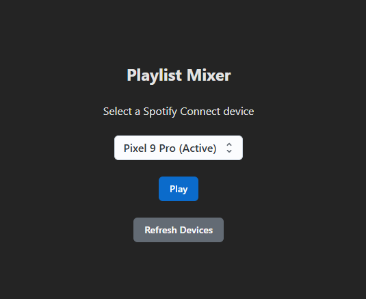

## Playlist Mixer

This small webapp is built to get around Spotify's inability to play folders. 

Given a list of playlist IDs and a selected Spotify Connect device, it will:
1. Get all the track IDs from the playlists
2. Shuffle those IDs
3. Call the Spotify API to play all the tracks on the selected device.

This app has the following restrictions at this time:
- It only supports my personal use case and playlists for now. If you want to try it yourself, you can fork this and make your adjustments.
- It does not actually play folders of Spotify playlists, only simulates a folder. This is because Spotify's [public playback API](https://developer.spotify.com/documentation/web-api/reference/start-a-users-playback) does not support passing a folder ID.
- This only works for Spotify Premium users due to Spotify API restrictions.
- Only one "folder" is supported, all playlists that it can read will be read and shuffled.

### Build and run
`npm i && npm run dev`